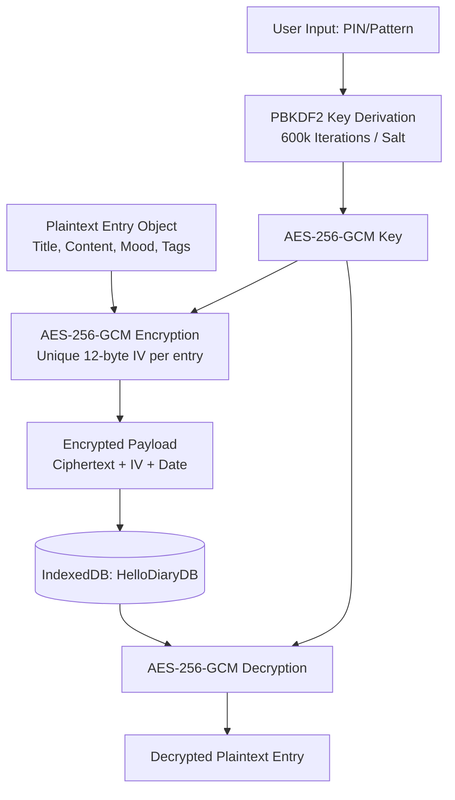

# Hello Diary — Step 2 Implementation Plan

This phase implements the **Cryptographic Engine** and the **IndexedDB Storage System** from scratch. These two modules form the security and data backbone of the application, ensuring all journal entries are stored securely with zero-knowledge AES-256-GCM encryption.

---

## 🎨 Proposed Architecture

---

## 🙋 User Review Required

> [!IMPORTANT]
> **Zero-Knowledge Encryption Rules**: 
> * Because the encryption keys are derived on-the-fly directly from the user's PIN/Pattern using PBKDF2, the password is never stored anywhere on the disk.
> * If the user forgets their PIN/Pattern, **the data cannot be recovered**. 
> * To verify the PIN correctness on launch, we will encrypt a static signature phrase (`"HelloDiarySanctuary"`) at setup time. Upon unlock, we attempt to decrypt this signature. If decryption succeeds, the PIN is correct. If it throws an error, the PIN is incorrect.

---

## 🛠️ Proposed Changes

### Database & Security Components

#### [NEW] [crypto.js](file:///C:/Users/rahul2/.gemini/antigravity/scratch/hello-diary/js/crypto.js)
* Manages all cryptographic primitives using the native browser **Web Crypto API**:
  * `deriveKey(pinOrPattern, salt)`: Derives a 256-bit AES key using PBKDF2 with SHA-256, 600,000 iterations, and a 16-byte random salt.
  * `encryptData(plaintextStr, key)`: Generates a cryptographically secure random 12-byte IV, encrypts the plaintext using AES-256-GCM, and returns `{ ciphertext: hexString, iv: hexString }`.
  * `decryptData(ciphertextHex, ivHex, key)`: Decrypts the ciphertext using the key and IV, returning the raw plaintext string (or throwing an error if the key/IV is invalid or tampered with).
  * `generateSalt()`: Returns a random 16-byte hex salt using `crypto.getRandomValues`.

#### [NEW] [db.js](file:///C:/Users/rahul2/.gemini/antigravity/scratch/hello-diary/js/db.js)
* Wrapper class for native browser **IndexedDB** (`HelloDiaryDB`, Version 1):
  * **Object Stores**:
    1. `credentials`: Stores `{ id: 'auth_config', salt: hexString, verificationIv: hexString, verificationCiphertext: hexString }`.
    2. `entries`: Stores `{ id: uuidString, date: timestamp, payload: encryptedHexString, iv: ivHexString }` with an index on `date`.
    3. `settings`: Stores `{ key: string, value: any }` for unencrypted configuration options like theme, active font-family, font-size, etc.
    4. `media`: Stores `{ id: uuidString, entryId: string, payload: encryptedBlobHexString, iv: ivHexString, mimeType: string }`.
  * **API Methods**:
    * `initDatabase()`: Initializes or opens the database connection and configures schemas.
    * `saveCredentials(pinOrPattern)`: Initializes database credentials (generates salt, derives key, creates static signature ciphertext) during setup.
    * `verifyCredentials(pinOrPattern)`: Retrieves credentials, derives key, and verifies it against the static signature. Returns the derived key on success.
    * `insertEntry(entryObj, key)`: Encrypts and saves a new diary entry.
    * `updateEntry(entryObj, key)`: Re-encrypts and updates an existing entry.
    * `deleteEntry(entryId)`: Deletes an entry by ID.
    * `getDecryptedEntry(entryId, key)`: Retrieves and decrypts a single entry.
    * `getAllDecryptedEntries(key)`: Retrieves, decrypts, and sorts all entries for the timeline/calendar views.
    * `getSetting(key)` / `setSetting(key, val)`: Sets and gets unencrypted settings.

---

## 🔍 Verification Plan

### Automated Tests
We will write a Node.js verification script `verify-db-crypto.js` in `scratch/hello-diary/js/` that runs in headless Chrome:
1. Opens the app and creates a mock database.
2. Registers a PIN code (`"123456"`).
3. Verifies success of `"123456"` and failure of an incorrect PIN (`"999999"`).
4. Inserts a mock diary entry containing sensitive text (`"This is my secret thoughts"`), tags, and mood.
5. Inspects the raw database records inside IndexedDB to verify that the entry text is fully encrypted (meaning the database contains only hex ciphertexts, not plain text).
6. Decrypts the entry using the correct key to verify the plaintext matches the original input.
7. Deletes the entry and verifies it is removed.
