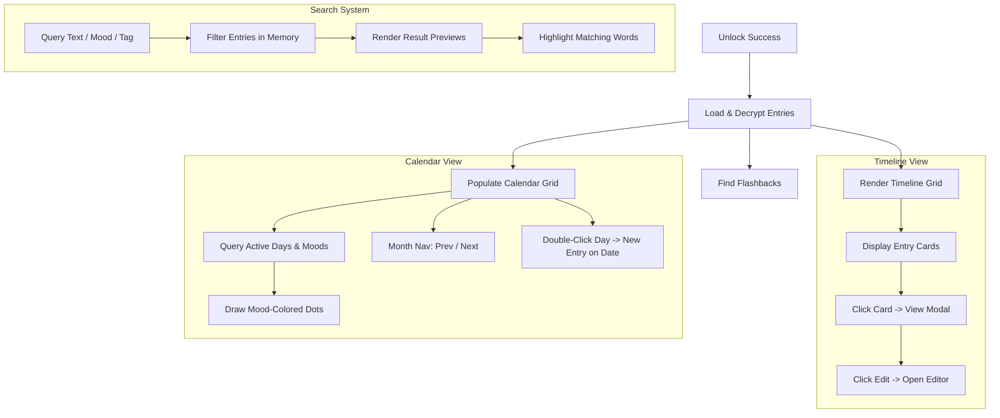

# Hello Diary — Step 4 Implementation Plan: Dashboard Timeline, Calendar, & Search

This phase connects our secure database layer (`HelloDB`) to the dashboard interface to load, decrypt, display, and search user memories in real-time using the volatile session key.

---

## 🎨 Proposed Architecture

---

## 🙋 User Review Required

> [!IMPORTANT]
> **Key UX Features**:
> * **Double-click Day to Write**: Double-clicking any day in the Calendar Grid will automatically navigate the user to the Editor screen, preset with the target calendar date, allowing writing of historical entries.
> * **Volatile Decryption**: All entries are decrypted dynamically on unlock. The plaintext content is never cached on disk or localStorage.
> * **Multi-Criteria Search**: Users can narrow down memories by typing text, choosing a mood, or clicking tag buttons in the search overlay.

---

## 🛠️ Proposed Changes

### 1. HTML Configuration

#### [MODIFY] [index.html](file:///C:/Users/rahul2/.gemini/antigravity/scratch/hello-diary/index.html)
* **Search Panel Enhancements**:
  * Add tag swatches container `#search-tags-container` and mood buttons inside `#search-panel`.
* **Calendar Grid Hooks**:
  * Add unique IDs for previous month (`btn-calendar-prev`), next month (`btn-calendar-next`), month label (`calendar-month-year`), and the grid container (`calendar-grid`).
* **On This Day Widget**:
  * Add an ID to the flashback card `#flashback-card` and its details container.

### 2. Stylesheets Update

#### [MODIFY] [components.css](file:///C:/Users/rahul2/.gemini/antigravity/scratch/hello-diary/css/components.css)
* Add styling rules for `.search-overlay` (glassmorphism overlay with absolute layout positioning, blur, and opacity transitions).
* Add styles for `.search-bar`, `.search-results`, and `.search-filters` (including `.search-mood-btn` and `.search-tag-btn` active/hover states).
* Add styles for calendar dot indicators representing mood levels (`--mood-1` to `--mood-5`).

### 3. Application Controller Logic

#### [MODIFY] [app.js](file:///C:/Users/rahul2/.gemini/antigravity/scratch/hello-diary/js/app.js)
* **On Unlock**:
  * Call `loadAndRenderDashboard()` which triggers Timeline render, Calendar render, and "On This Day" calculations.
* **Timeline Controller**:
  * Create `renderTimeline()`:
    * Fetch all decrypted entries.
    * Sort reverse-chronologically.
    * Build HTML card components displaying date, mood emoji, title, truncated description, and tag pills.
    * Attach click handlers for opening read-only modal or editor.
* **Calendar Controller**:
  * Create `renderCalendar(date)`:
    * Generate month grids with proper padding days.
    * Mark days containing diary entries with colored indicators matched to the entry's mood value.
    * Handle prev/next month button clicks.
    * Bind double-click events to days, triggering editor navigation preset with the date.
* **Search Controller**:
  * Create `initSearch()`:
    * Store all decrypted entries in a search index.
    * Listen to `#search-box` input keyups, tag button toggles, and mood button clicks.
    * Perform fuzzy full-text matches, highlighting matched query words using `<mark>` tags.
    * Display result cards in `#search-list-box`.
* **On This Day Controller**:
  * Create `renderOnThisDay()`:
    * Compare entries' month and day indices against the current local date.
    * If matches exist in previous years, display a random memory flashback. Otherwise, hide the widget.

---

## 🔍 Verification Plan

### Manual Verification
1. **Dynamic Timeline**:
   - Unlock app. Create a few entries with different moods and tags in the editor.
   - Verify they show up in the timeline correctly, displaying mood emojis and tag pills.
2. **Calendar Integration**:
   - Navigate to Calendar view. Verify current month is correctly formatted.
   - Verify day numbers matching created entry dates have correct mood-colored dots underneath.
   - Double-click an empty date. Verify editor opens preset to that date.
3. **Advanced Search**:
   - Open Search Panel. Enter search text. Verify results list dynamically.
   - Highlighted matches must appear for matching words.
   - Click a mood filter button. Verify results only show that mood.
   - Click a tag. Verify it filters by tag.

### Automated Tests
* We will expand the CDP integration test script `tests/run-ui-tests.js` to automate:
  - Creating mock entries with specific dates, moods, and tags.
  - Asserting correct elements exist in timeline and calendar grid.
  - Performing searches and filtering results, checking node attributes.
