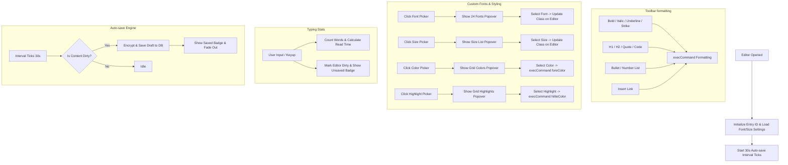

# Hello Diary — Step 5 Implementation Plan: Premium Editor, Auto-save & Custom Fonts

This phase enhances the diary's writing core, converting it into a premium text editor with rich styling options, custom formatting layouts, word counting, reading stats, font styling select dropdowns, and an auto-save engine.

---

## 🎨 Proposed Architecture

---

## 🙋 User Review Required

> [!IMPORTANT]
> **Key Editor Features**:
> * **Automatic Entry ID Generation**: To support auto-saving drafts of brand-new entries, a secure ID will be pre-generated immediately when creating a new diary entry, ensuring it can auto-save to IndexedDB securely.
> * **Font Preferences Storage**: The chosen font style and size scale are persisted globally in IndexedDB configuration, so they default to the user's last preferred settings when reopening the editor.
> * **24 Premium Fonts Selection**: Google Fonts imported and selectable: Merriweather, Lora, Inter, Caveat, Dancing Script, Pacifico, JetBrains Mono, Roboto, Montserrat, Great Vibes, Cinzel, Cormorant Garamond, Comfortaa, Sacramento, Special Elite, Amatic SC, Playfair Display, Outfit, Architects Daughter, Abril Fatface, Poiret One, Josefin Sans, Satisfy, and Shadows Into Light.
> * **Advanced Text Formatting**: Real-time formatting for bold, italic, underline, strikethrough, subscript, superscript, text alignment, list styles, link insertions, code block styling, foreground text color grids, and text highlight/marker colors.

---

## 🛠️ Proposed Changes

### 1. HTML Additions

#### [MODIFY] [index.html](file:///C:/Users/rahul2/.gemini/antigravity/scratch/hello-diary/index.html)
* Append the dropdown container elements for the font picker (`#dropdown-font`), font size picker (`#dropdown-size`), text color picker (`#dropdown-color`), and highlight picker (`#dropdown-highlight`) inside the `.editor-toolbar`.
* Ensure all toolbar buttons have matching `data-cmd` properties.

### 2. Stylesheets Update

#### [MODIFY] [editor.css](file:///C:/Users/rahul2/.gemini/antigravity/scratch/hello-diary/css/editor.css)
* Add styling rules for `.editor-dropdown` class, including absolute positioning, glassmorphism border, list layouts, and active/hover styling for choices.
* Added grid-based color choice controls using circle tags (`.color-circle`, `.color-circle--clear`) for visual color selection popovers.
* Ensure all 24 typography font families have import statements (Google Fonts) and matching editor body classes (e.g. `.font-inter`, `.font-caveat`, etc.).

### 3. Application Controller Logic

#### [MODIFY] [app.js](file:///C:/Users/rahul2/.gemini/antigravity/scratch/hello-diary/js/app.js)
* **Editor Initialization**:
  * On editor load, load user-selected default font style and size scale from database settings.
  * Start a `setInterval` running every 30 seconds to check if the editor is dirty.
* **Formatting Controls**:
  * Bind click handlers to `.toolbar-btn` formatting elements to execute command APIs (Bold, Italic, Underline, Lists, etc.).
* **Typography Selector Popups**:
  * Bind triggers for Font/Size pickers to toggle the popup overlays.
  * Listen to clicks on options, apply matching class names to `#rich-editor-field`, save preference to database, and highlight the active choice.
* **Typing Listeners & Word Counter**:
  * Listen to keyup and input events on the editor field.
  * Parse text and update `#editor-word-count` and `#editor-read-time` dynamically.
  * Flag the editor state as `dirty`.
* **Auto-save Handler**:
  * Write `autoSaveDraft()` that encrypts the editor title, body, tags, and mood selection, saving it to IndexedDB.
  * Toggle `.save-indicator` badge states to display progress feedback.

---

## 🔍 Verification Plan

### Manual Verification
1. **Rich Styling Action**:
   - Write text, highlight it, and click Bold/Italic/Underline. Assert styling tags are added.
2. **Dynamic Typography**:
   - Open Font Picker. Click a font family (e.g., *Caveat* or *JetBrains Mono*). Verify editor writing font updates instantly.
   - Reload page, go to new entry. Verify last-selected font remains active.
3. **Draft Auto-save**:
   - Write a title and start typing body text. Note the `Unsaved Changes` badge appearing.
   - Wait 30 seconds. Verify the badge changes to `Auto-Saved` and fades out.
   - Reload page. Unlock app. Verify the draft is visible in the timeline and can be opened with all written contents intact.
4. **Reading Statistics**:
   - Type a paragraph. Assert word count increments correctly and read-time updates based on reading speed estimate.

### Automated Tests
* Expand `tests/run-ui-tests.js` to assert:
  - Toolbar buttons correctly invoke formatting command triggers.
  - Selecting different fonts toggles matching classes on `#rich-editor-field`.
  - Auto-save timer triggers correctly and updates IndexedDB record values, checked via console script evaluations.
